## Personal Trainer GP

Este projeto é uma aplicação REST interativa que gera planos de treino personalizados com base nos dados fornecidos pelo usuário, como o `tipo de treino`, `nível de experiência` e `dias` disponíveis. A aplicação oferece opções de treino `Funcional`, `Cardio` e `Peso Livre`, com rotinas detalhadas para `cada` tipo de treino. Além disso a aplicação também possuí uma pagina de `cadastro e login com autenticação`. O usuario e o treino gerado são armazenados em um `banco de dados`.

## Funcionalidades
* **Treino Funcional**: Rotinas que combinam exercícios de cardio com exercícios de força, ideais para melhorar a resistência física.
* **Treino Cardio**: Focado em atividades aeróbicas, como corrida e pular corda, com variações para diferentes níveis de experiência.
* **Treino de Peso Livre**: Rotinas adaptadas com foco em exercícios de força como supino, agachamentos e levantamento de pesos.

Cada rotina de treino é personalizada com base no nível de experiência do usuário (iniciante, intermediário ou avançado) e no número de dias de treino por semana (1, 3 ou 5 dias).

## Estrutura do Projeto
Parte1

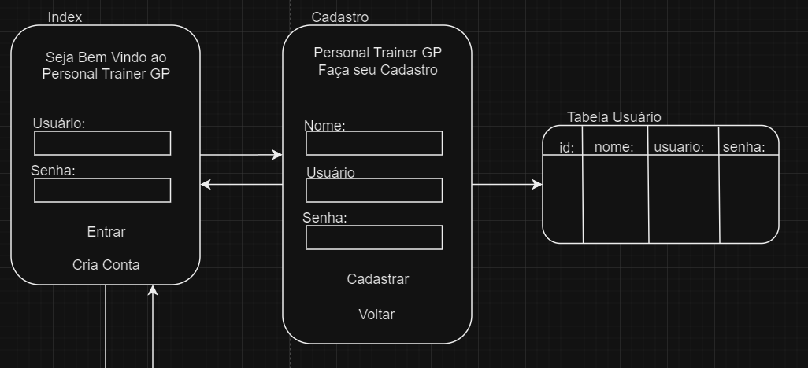

Parte2

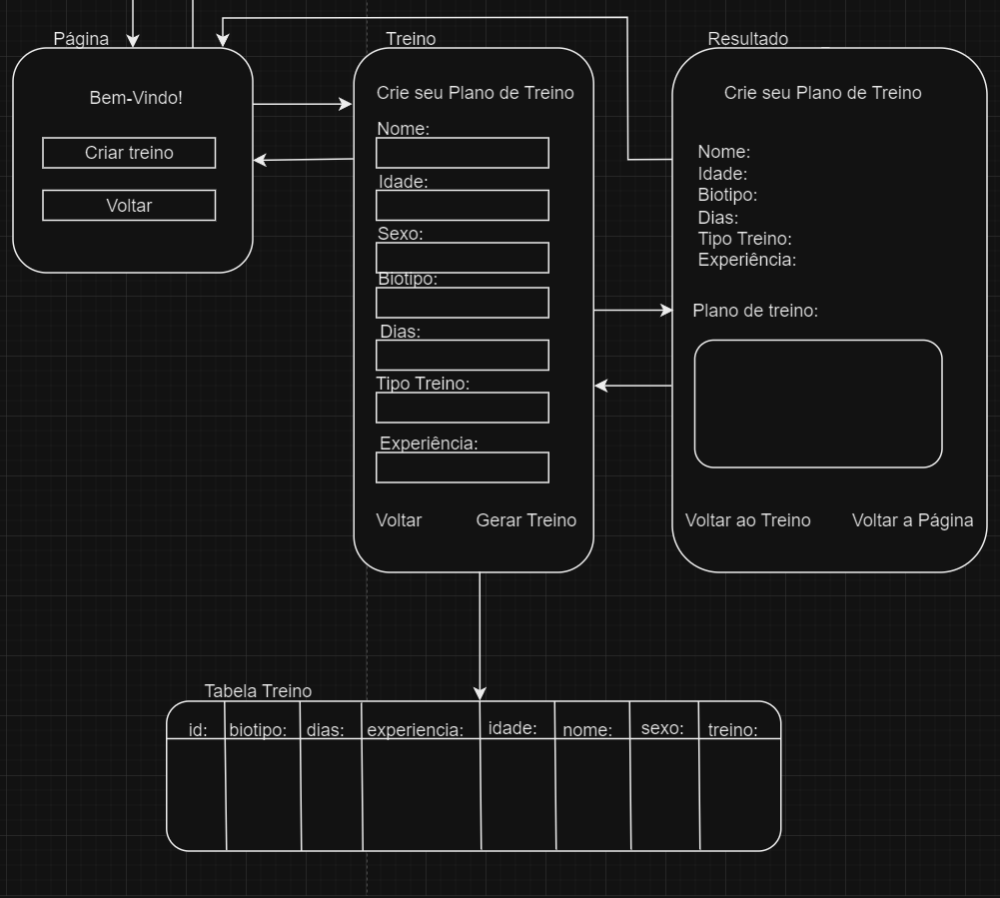

### Estrutura da lógica
Nível `Iniciante`

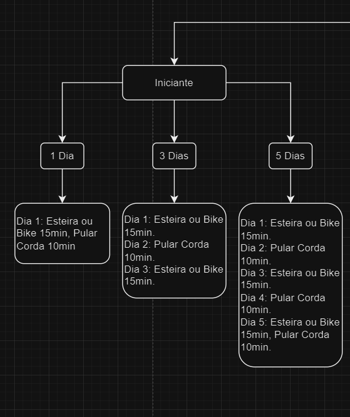

Nível `Intermediário`

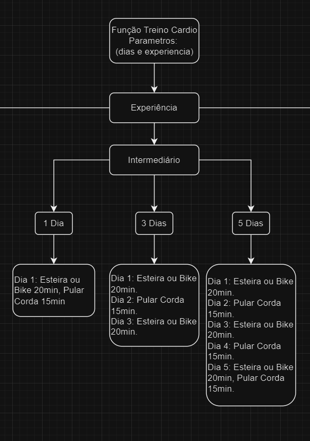

Nível `Avançado`

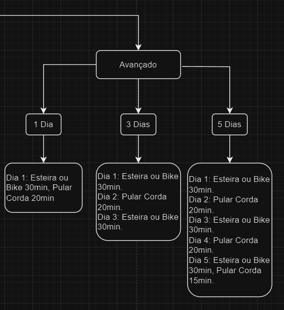

## Tecnologias Utilizadas

* **Spring Boot**: Framework para desenvolvimento do back-end, gerenciamento das rotas e controle de autenticação.

* **HTML5**: Estrutura das páginas web.

* **CSS3**: Estilização do layout e dos componentes.

* **JavaScript**: Lógica de geração de rotinas de treino e manipulação de interações do usuário.

* **Java**: Para o desenvolvimento do back-end.

* **MySQL**: Banco de dados relacional para armazenamento de dados de usuários e dados de treino.

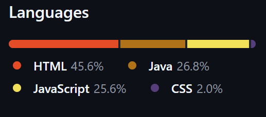

## Como Utilizar

Acesse: 

### Página Principal
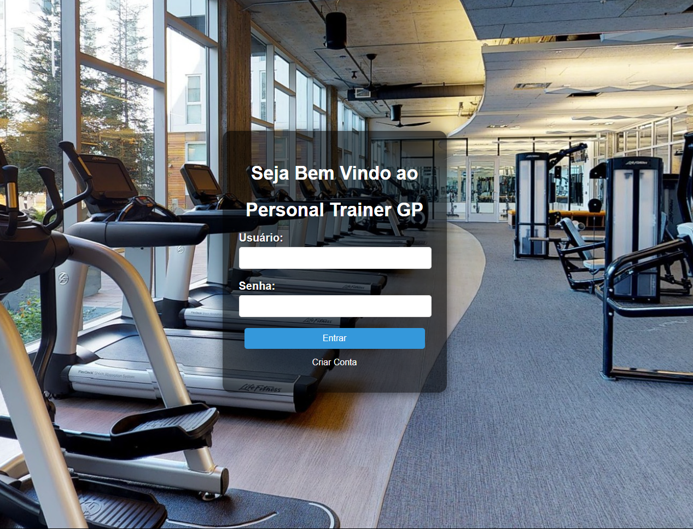

Clique em `Criar Conta` para criar seu cadastro

### Crie seu `Cadastro`
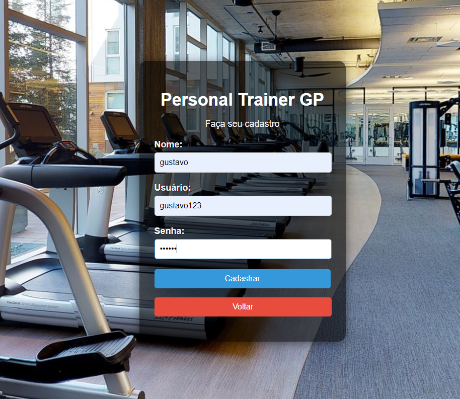

O cadastro será validado:

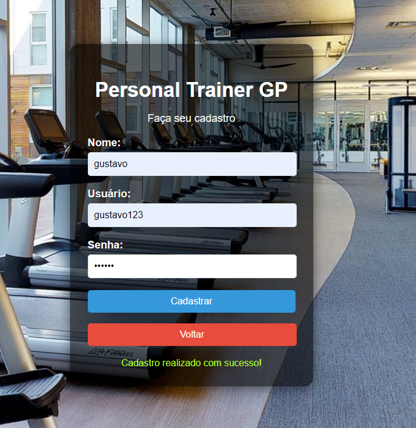

### Faça `Login`

### Clique em `Criar Treino`

### Preencha com seus dados e clique em `Gerar Plano de Treino`
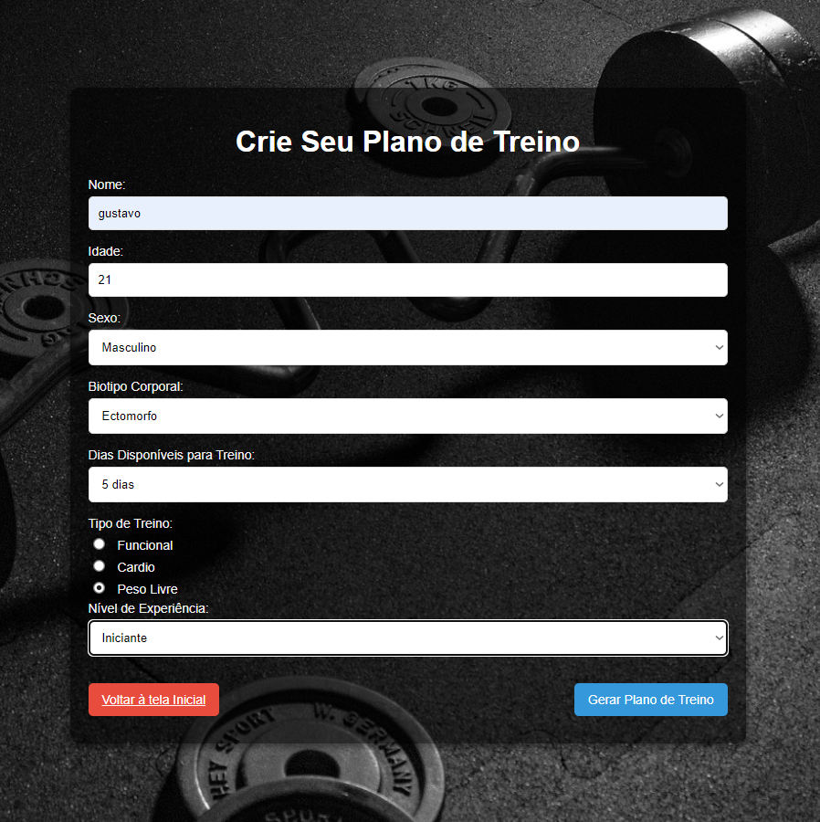

### Resultado
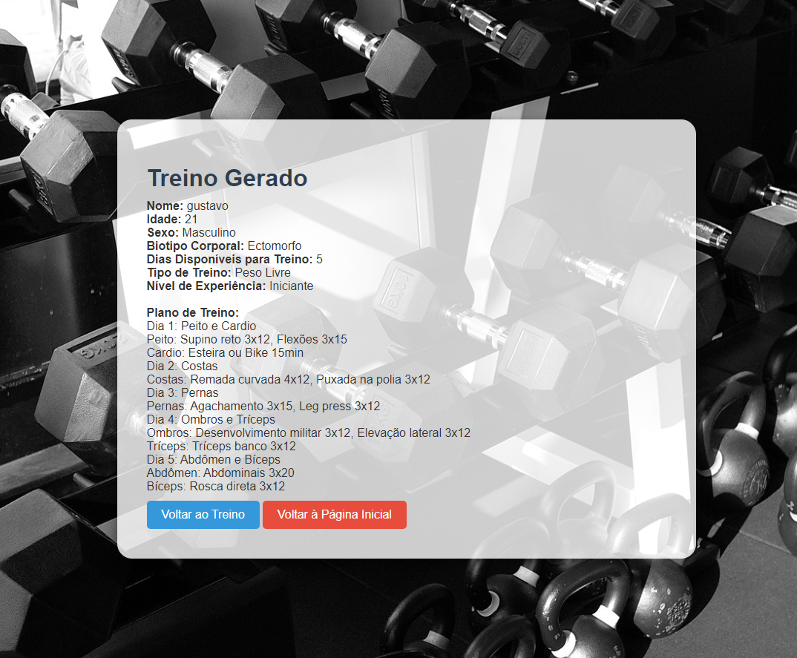

## Banco de dados
### Tabela `Usuário`:
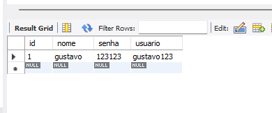

### Tabela `Treino`:
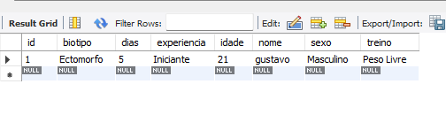

## Melhorias Futuras

* Vincular ao banco de dados para criar um histórico de treinos.
* Fazer uma análise estatística do histórico.
* Ajustar as saídas dos treinos para valores mais próximos da realidade.
* Melhorar Design.
* Aplicação com mais segurança.
* Vincular as tabelas.

## Contribuições
Sinta-se à vontade para contribuir com melhorias no código, correções de bugs ou novas funcionalidades.
* Faça um fork do projeto.
* Crie uma branch com suas alterações.
* Envie um Pull Request.

## Autor
**Guustavohgp**